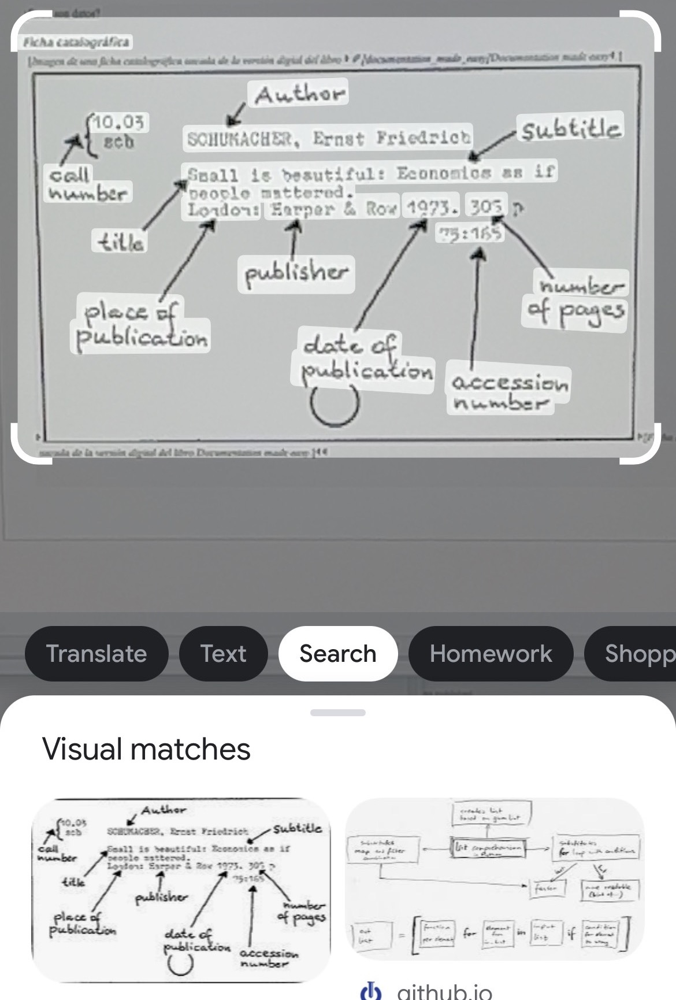

# Data Mining

**Note:**

This image and the two subsequent ones represent screen captures of the Google Lens app \(captured on iOS in August 2022\).

The intent of this example, created before the release of ChatGPT, was to demonstrate that AI tools like this one can be used to extract and expose data in new ways, but they do not have access to an underlying semantic model that can be used to understand the meaning of the data and what it represents.

**Previous topic:**[The Data Deluge](../../day_1/lesson_0/data_deluge.md)

**Next topic:**[Data Reading](../../day_1/lesson_0/data_reading.md)

## Summary

With the constant development of artificial intelligence tools and models, it's becoming easier and easier to extract data from digital content.

