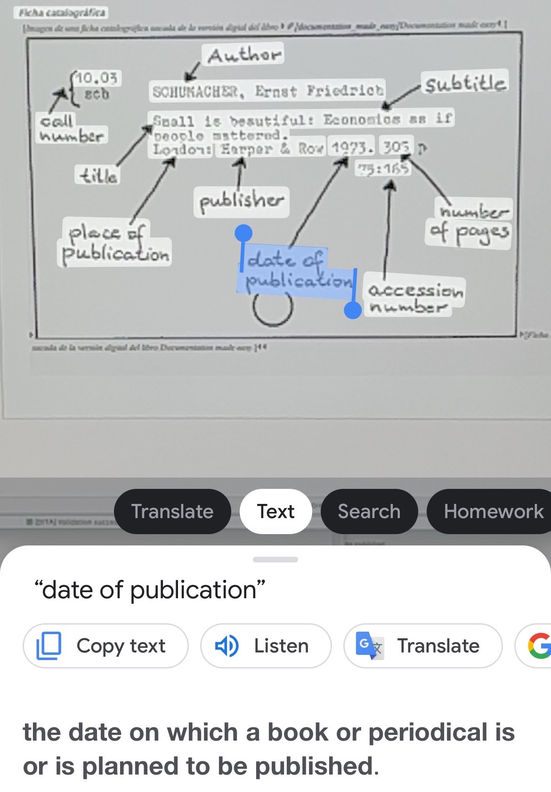

# Data Reading

**Previous topic:**[Data Mining](../../day_1/lesson_0/data_mining.md)

**Next topic:**[Data Translating](../../day_1/lesson_0/data_translating.md)

## Summary

Intelligent text recognition can make search and comprehension easier.

