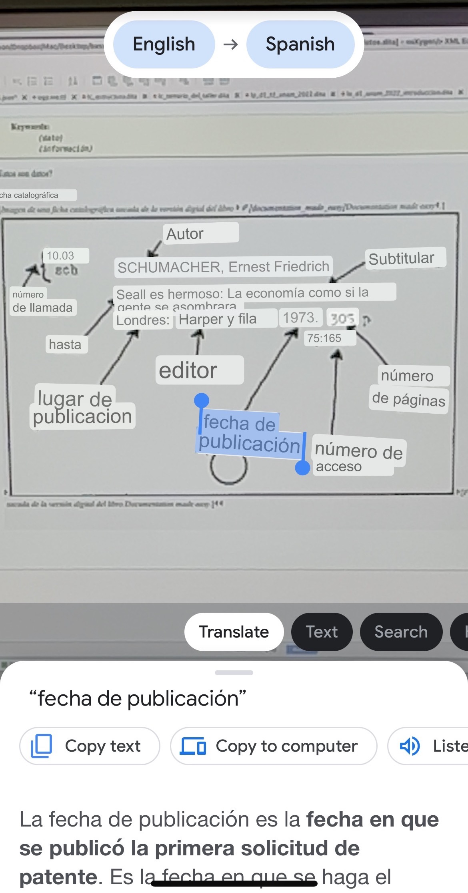

# Data Translating

**Previous topic:**[Data Reading](../../day_1/lesson_0/data_reading.md)

**Next topic:**[Data Semantics](../../day_1/lesson_0/data_semantics.md)

## Summary

Machine translation facilitates communication and understanding across language barriers.

