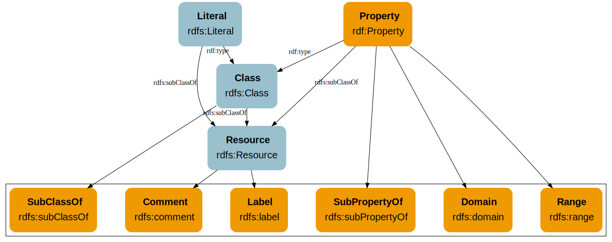

# Overview of RDF Schema

**Previous topic:**[RDF Schema](../../day_1/lesson_4/rdf_schema.md)

**Next topic:**[Classes](../../day_1/lesson_4/classes.md)

## Summary

-   With RDFS, we can begin to define hierarchies of classes and properties.
-   The Web Ontology Language \(OWL\) builds on these basic features and adds much more advanced functionality.

