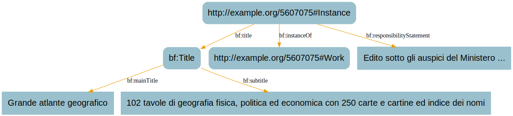

# BIBFRAME Patterns: Title

BIBFRAME 2.0 model

**Previous topic:**[BIBFRAME Patterns: Contribution](../../../day_1/lesson_5/topic_1/bibframe_patterns_contribution.md)

**Next topic:**[BIBFRAME Patterns: Provision Activity \(Publication\)](../../../day_1/lesson_5/topic_1/bibframe_patterns_provision_publication.md)

